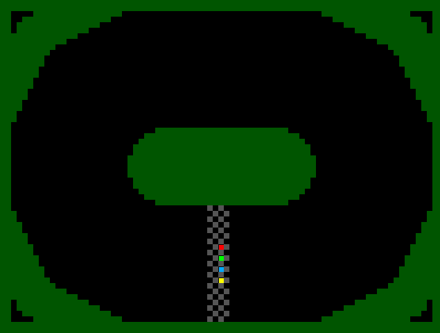
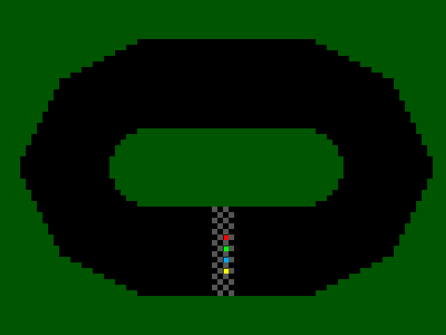
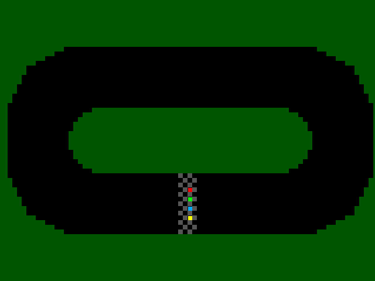
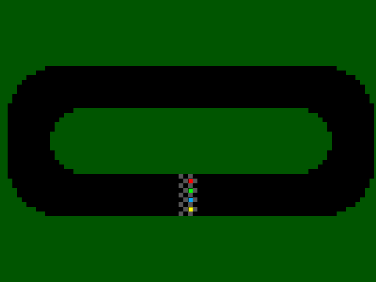

   

# Zuzel (Motocross) game on a chip by KK/Altair - recreation of a game by Piotr Kamiński created in 1994 ported to pure silicon architecture sponsored by IEEE
[Watch game play of original game here](https://www.youtube.com/watch?v=TAxoQyd6Lxc)

Custom multi-CPU architecture was designed to fit complete project on a small area of silicon (100 um x 160 um).

## How it works

A motor track racing game for up to 4 players.
Each player controls his/her bike using a single input pin: 0 - straight+accelerate, 1 - turn left+brake.
Outpace your opponents and don't fall out of the track!

The game features 4 selectable tracks and 4 selectable motor speed settings.

## How to test

Connect to VGA using VGA PMOD on Output port.
Use Input pins 0..3 to control motobikes and Input pin 4 to reset (restart) the game.
Use Bidirectional pins 1..0 to select the track and Bidirectional pins 3..2 to select the speed/turn preset.

## External hardware

- VGA output PMOD
- Gameplay reset signal on Input[4]
- 4 input signals from player controls (active 1) on Input[3:0]
- 2-bit track select on Bidirectional[1:0]
- 2-bit speed/turn preset select on Bidirectional[3:2]
